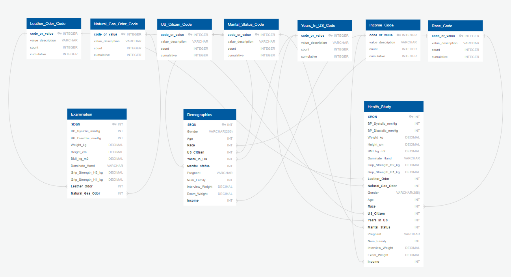

Project 2: ETL Challenge

Briana Friendt, Haley Huhtala, Ian Mac Moore and Kaylene Retka

For our project we are using data from the CDC - National Health and Examination Health Survey (2013-2014). We started by exploring the data and determining which of the 6 data sets we wanted to use. We selected the demographic data set and examination data set. 

The columns in each data set had variable names. We started our project by creating a variable database for the column names. This allowed us to determine which columns we wanted to keep in our final database. The ETL process will create a normalized database with 10 tables in PostgreSQL. 

These are the steps that were taken:

Establish a database schema using [quickdatabasediagrams.com](https://www.quickdatabasediagrams.com/)

The data was exported to predefine the database in PostgresSQL see [CodeTableQDB.txt](CodeTableQDB.txt)

EXTRACT: 

The CSV files were downloaded. Original copies are located in the Resources folder.
1. demographic.csv - [source kaggle.com](https://www.kaggle.com/cdc/national-health-and-nutrition-examination-survey?select=demographic.csv)
2. examination.csv - [source kaggle.com](https://www.kaggle.com/cdc/national-health-and-nutrition-examination-survey?select=examination.csv)

TRANSFORM:

- Filter data to narrow down focus (ex. Xray results and oral health). The data set had over 200 columns, these were narrowed down to a more manageable number. This filtering was done in Excel. [demographic_modified.csv](Resources/demographic_modified.csv) [examination_modified.csv](Resources/examination_modified.csv)
- The original CSV files were formated where many columns had a code, with a seperate reference table, instead of actual values listed in each row. Some of these values (gender, family size & if pregnant) were replaced using the find/replace function in Excel. The rest will have reference tables that will be added to our final data set as seperate tables. These reference tables will be added to our final data base.  
- Rename columns (variable name to descriptor) in Excel. [demographic_modified_renamed_columns.csv](Resources/demographic_modified_renamed_columns.csv) [examination_modified_renamed_columns.csv](Resources/examination_modified_renamed_columns.csv)
- Create SQL code to establish tables and insert records into code tables with foreign keys [Table_Setup_New.sql](Table_Setup_New.sql)
- Import CSV files into Demographics and Examination tables in PgAdmin
- Create a temp table to join the records and columns from Demographics and Examination tables

LOAD: 
- Insert the unique columns from the temporary table into the health study table excluding any records with any null values.
- Use Excel and a select query to verify the correct number of records and to ensure no null values.
- Drop the Demographic and Examination tables 